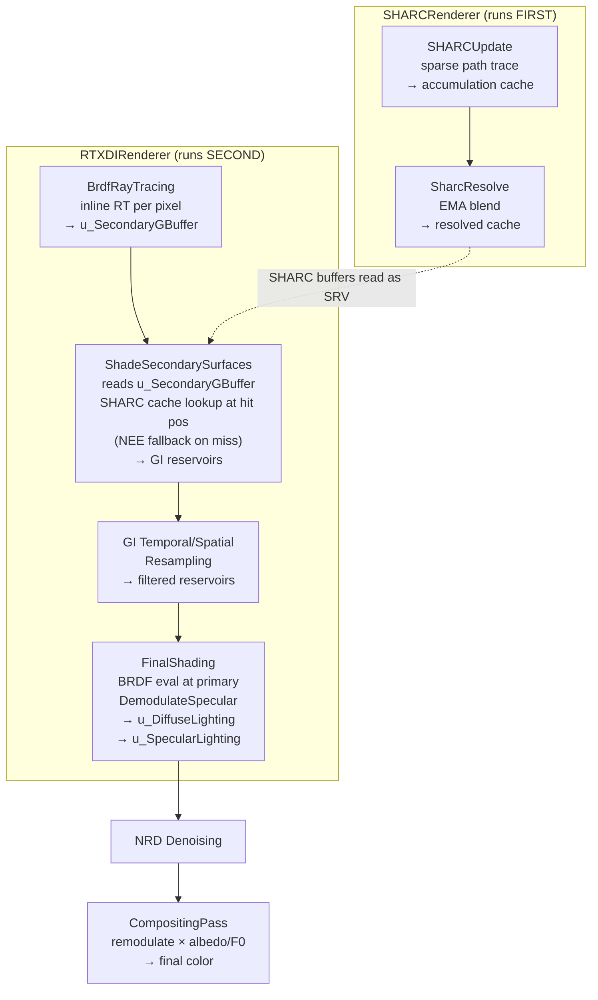
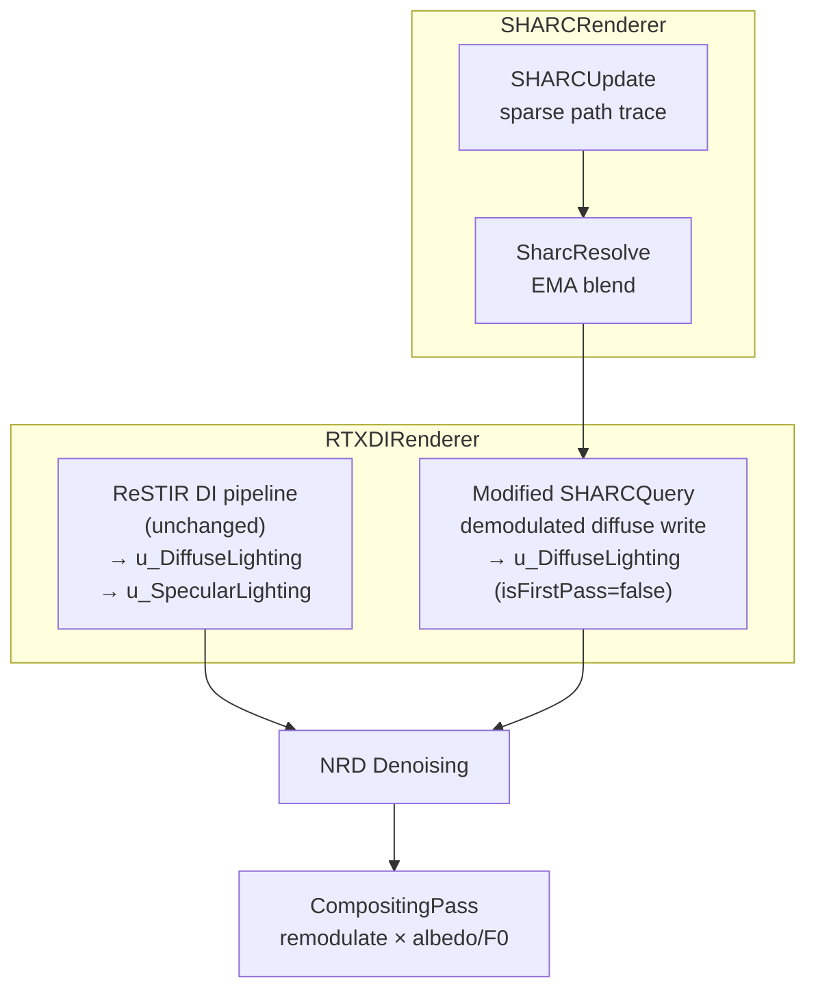

# SHARC + ReSTIR GI Pipeline Simplification — Feasibility Analysis

> **Question:** Can we replace BrdfRayTracing + secondary G-buffer + ReSTIR GI resampling with just a SHARC Query pass feeding into NRD?
> **Goal:** Eliminate expensive BRDF ray tracing and secondary G-buffer; keep only SHARC Update/Resolve + a modified SHARC Query → NRD.
> **Author:** Generated from codebase analysis
> **Date:** 2026-07-09

---

## Table of Contents

1. [Executive Summary](#1-executive-summary)
2. [Current Pipeline Architecture](#2-current-pipeline-architecture)
3. [SHARC Internals](#3-sharc-internals)
4. [Redundancy Analysis](#4-redundancy-analysis)
5. [Proposed Simplified Pipeline](#5-proposed-simplified-pipeline)
6. [Demodulation Analysis](#6-demodulation-analysis)
7. [NRD Integration Concerns](#7-nrd-integration-concerns)
8. [What is Lost](#8-what-is-lost)
9. [Implementation Roadmap](#9-implementation-roadmap)
10. [Verdict](#10-verdict)

---

## 1. Executive Summary

**Your theory is correct and feasible.** The current combined mode (`RESTIR_GI_SHARC`) performs redundant ray tracing: `BrdfRayTracing` traces BRDF rays from primary surfaces, then `ShadeSecondarySurfaces` queries the SHARC cache at those secondary hit positions. But SHARC already has its own tracing infrastructure (`SHARCQuery` pass) that does the same thing — trace from primary surface, find a valid cache lookup point, and retrieve cached radiance.

The entire ReSTIR GI sub-pipeline (`BrdfRayTracing` → `ShadeSecondarySurfaces` → `GI Temporal/Spatial Resampling` → `FinalShading`) can be **eliminated** and replaced with a **modified SHARC Query pass** that writes demodulated diffuse into `u_DiffuseLighting`, which then flows through NRD denoising and `CompositingPass` remodulation — the same path DI already takes.

The cost savings are substantial: ~5 full-screen compute passes removed, the secondary G-buffer eliminated, and per-pixel BRDF ray tracing replaced with SHARC's sparse (Update) + lightweight (Query) approach.

---

## 2. Current Pipeline Architecture

### 2.1 Frame Pass Order

The renderer execution order (from [Renderer.cpp](src/Renderer.cpp), line ~1024):

```
SHARCRenderer       →  RTXDIRenderer     →  DeferredRenderer
(SHARC cache mgmt)     (ReSTIR DI + GI)     (final composite)
```

### 2.2 SHARCRenderer Passes

| Step | Pass | Description | GPU Work |
|------|------|-------------|----------|
| 1 | `SHARCUpdate` | Sparse path tracing, populates accumulation cache | **Heavy** — sparse RT, NEE at hits, signal back-propagation |
| 2 | `SharcResolve` | Temporal EMA blend, staleness eviction | Light — linear dispatch over cache entries |
| 3 | `SHARCQuery` | **SKIPPED in combined mode** | N/A in combined mode |

Relevant code: [SHARCRenderer.cpp](src/SHARCRenderer.cpp), lines 189-281

### 2.3 RTXDIRenderer Passes (Combined Mode)

| Step | Pass | Description | GPU Work |
|------|------|-------------|----------|
| 1 | `BrdfRayTracing` | Inline RT per pixel, traces BRDF rays | **Heavy** — full-screen inline raytracing |
| 2 | `ShadeSecondarySurfaces` | Reads secondary G-buffer, queries SHARC cache or falls back to NEE | **Heavy** — NEE + spatial resampling |
| 3 | `GI TemporalResampling` | Temporal reservoir resampling (optional) | Medium |
| 4 | `GI SpatialResampling` | Spatial reservoir resampling (optional) | Medium |
| 5 | `FinalShading` | Evaluates BRDF at primary, demodulates, writes to NRD | Medium |
| 6 | NRD Denoising | REBLUR/RELAX denoising | **Heavy** |

Relevant code: [RTXDIRenderer.cpp](src/RTXDIRenderer.cpp), lines 2154-2250

### 2.4 Data Flow Diagram (Current Combined Mode)



### 2.5 DeferredRenderer Compositing (Combined Mode)

In [DeferredLighting.hlsl](src/shaders/DeferredLighting.hlsl), line ~123:

```hlsl
// SHARC indirect is ONLY added in pure SHARC mode — NOT in combined mode
if (g_Deferred.m_IndirectLightingMode == INDIRECT_LIGHTING_MODE_SHARC)
{
    color += g_SHARCIndirect.Load(uint3(uvInt, 0)).rgb;
}
```

In combined mode, the GI contribution arrives through the NRD → CompositingPass path,
not through the SHARC indirect texture.

---

## 3. SHARC Internals

### 3.1 SHARC Update Pass

File: [SHARCUpdate.hlsl](src/shaders/SHARCUpdate.hlsl)

- **Sparse**: One sample per `SPARSE_BLOCK_SIZE × SPARSE_BLOCK_SIZE` block, randomized per frame
- **Tracing**: Cosine-weighted diffuse random walk from primary surfaces
- **At each hit**: Evaluates direct lighting (all scene lights, NEE), feeds into accumulation cache
- **Signal back-propagation**: `SharcSetThroughput` + `SharcUpdateHit` propagates segment throughput to prior vertices
- **Cached radiance**: Already includes the hit surface's BSDF (diffuseAlbedo × (1-metallic) baked in)

### 3.2 SHARC Query Pass

File: [SHARCQuery.hlsl](src/shaders/SHARCQuery.hlsl)

- **Every pixel**: Full-screen dispatch
- **Tracing**: Cosine-weighted diffuse random walk from primary surface, continues until path length ≥ local voxel size (up to 4 bounces)
- **Cache lookup**: `SharcGetCachedRadiance()` at the final hit point
- **Output**: `indirectRadiance * albedo * (1 - metallic)` — already BSDF-modulated
- **Cost**: Lighter than BrdfRayTracing — only diffuse direction sampling, short paths

Key output line (SHARCQuery.hlsl line ~188):
```hlsl
float3 throughput = albedo.rgb * (1.0f - orm.g);  // diffuseAlbedo × (1-metallic)
u_IndirectOutput[pixel] = found ? float4(indirectRadiance * throughput, 1.0f) : float4(0, 0, 0, 0);
```

### 3.3 ShadeSecondarySurfaces SHARC Path (Combined Mode)

File: [ShadeSecondarySurfaces.hlsl](src/shaders/rtxdi/LightingPasses/ShadeSecondarySurfaces.hlsl), lines 92-130

```hlsl
if (g_Const.useSharcCache)
{
    // Build SharcParameters and call SharcGetCachedRadiance at secondarySurface.worldPos
    if (SharcGetCachedRadiance(sharcParams, sharcHitData, cachedRadiance, false))
    {
        radiance += cachedRadiance;  // Cache HIT — cheap path
        usedCache = true;
    }
}
if (!usedCache)
{
    // NEE fallback: SampleLightsForSurface at secondary hit (expensive)
}
```

This queries the cache at the **secondary hit position** found by BrdfRayTracing, NOT at the primary surface. The key difference from SHARCQuery: Query traces FROM the primary TO find a cache point; ShadeSecondarySurfaces already HAS a point (from BrdfRayTracing) and just does the lookup.

---

## 4. Redundancy Analysis

### 4.1 The Double-Trace Problem

Both paths ultimately do the same thing:

| Operation | SHARCQuery (standalone) | Combined Mode |
|-----------|------------------------|---------------|
| Trace from primary | Yes (diffuse walk, ≤4 bounces) | Yes (BrdfRayTracing, 1 BRDF bounce) |
| Find cache lookup point | Accumulated path ≥ voxel size | Secondary hit position |
| Query SHARC cache | `SharcGetCachedRadiance()` | `SharcGetCachedRadiance()` |
| Cost per pixel | Light diffuse trace | Heavy BRDF trace + secondary G-buffer write |

BrdfRayTracing is more expensive because it:
1. Samples GGX VNDF for specular BRDF
2. Traces specular AND diffuse rays with Russian roulette
3. Extracts full hit attributes (normal, albedo, roughness, metallic, emissive)
4. Packs all of this into `u_SecondaryGBuffer` (11 float fields per pixel)
5. Does alpha-tested material handling inline

But the combined mode's SHARC cache query only needs the hit **position and normal**. The full secondary G-buffer is only needed for the NEE fallback path (when the cache misses).

### 4.2 What the GI Reservoir Chain Adds

After ShadeSecondarySurfaces seeds GI reservoirs, the resampling chain provides:
- **Temporal accumulation**: Reservoirs live across frames, blending old and new samples
- **Spatial reuse**: Neighboring pixels share samples
- **MIS weighting**: Combines initial sample with resampled result in FinalShading

But SHARC already has its own temporal accumulation via `SharcResolve` (EMA blend over `accumulationFrameNum` frames), and its spatial hash grid inherently provides spatial reuse (neighboring surfaces that hash to the same cell share radiance).

### 4.3 Memory Costs

| Resource | Size at 1080p | Notes |
|----------|---------------|-------|
| `u_SecondaryGBuffer` | ~47 MB | 11 × float per pixel (full res) |
| GI Reservoir buffer | ~8 MB | Per-pixel reservoir data |
| GI Reservoir history | ~8 MB | Previous frame |

These are eliminated in the simplified pipeline.

---

## 5. Proposed Simplified Pipeline (Combined Mode Only)

> **Standalone SHARC mode (`INDIRECT_LIGHTING_MODE_SHARC`) is NOT affected.** The proposal below only
> changes what happens when `INDIRECT_LIGHTING_MODE_RESTIR_GI_SHARC` is selected.

### 5.1 New Pass Order (Combined Mode)

```
SHARCRenderer:  SHARCUpdate → SharcResolve     (UNCHANGED — standalone SHARC is identical)
RTXDIRenderer:  ReSTIR DI (unchanged) → NEW SharcIndirectQuery → NRD → CompositingPass
```

The ReSTIR GI block (BrdfRayTracing, ShadeSecondarySurfaces, GI resampling, FinalShading) is **skipped** in combined mode. These passes still exist and run when `INDIRECT_LIGHTING_MODE_RESTIR_GI` is selected.

Standalone SHARC mode (`INDIRECT_LIGHTING_MODE_SHARC`) continues to run:
```
SHARCRenderer:  SHARCUpdate → SharcResolve → SHARCQuery → g_RG_SHARCIndirect
DeferredRenderer:  color += g_RG_SHARCIndirect
```
No NRD, no demodulation, no changes.

### 5.2 New Combined-Mode SHARC Query (NOT a modification to SHARCQuery.hlsl)

The key change: a **new shader** (not a modified `SHARCQuery.hlsl`) writes **demodulated** diffuse into `u_DiffuseLighting` instead of modulated output into `g_RG_SHARCIndirect`. This means:

```
Current:  u_IndirectOutput[pixel] = float4(indirectRadiance * albedo * (1-metallic), 1.0)
New:      u_DiffuseLighting[pixel] = NRD_Pack(indirectRadiance, syntheticHitT)
                                  where indirectRadiance is WITHOUT the albedo/(1-metallic) factor
```

### 5.3 Data Flow Diagram (Proposed)



### 5.4 Modified Store Flow

Currently the GI FinalShading calls:
```hlsl
StoreShadingOutput(GlobalIndex, pixelPosition,
    primarySurface.viewDepth, primarySurface.material.roughness,
    diffuse, specular, 0, false, true);
// isFirstPass=false → adds to existing DI in u_DiffuseLighting
// isLastPass=true  → NRD-packs the result
```

The modified SHARCQuery would do the same — write demodulated diffuse with `isFirstPass=false, isLastPass=true`, so it additively blends with DI and triggers NRD packing.

---

## 6. Demodulation Analysis

### 6.1 Why Demodulation is Necessary

The current NRD → CompositingPass path expects **demodulated** signals:

1. **DI input** (from ShadeSamples): `brdf.demodulatedDiffuse * radiance` and `DemodulateSpecular(specular)`
2. **GI input** (from FinalShading): `brdf.demodulatedDiffuse * radiance` and `DemodulateSpecular(specular)`
3. **CompositingPass**: Multiplies diffuse by `diffuseAlbedo`, specular by `specularF0`

But standalone `SHARCQuery.hlsl` currently writes `indirectRadiance * albedo * (1-metallic)` which is already modulated — and that is **correct** for its own path (DeferredRenderer adds it directly, no CompositingPass remodulation). The new combined-mode shader must intentionally skip the BSDF multiplication to produce a demodulated signal suitable for the NRD → CompositingPass path.

### 6.2 Verification: Do You Need to Demodulate?

**Yes, but ONLY for the new combined-mode shader.** If you feed SHARC's modulated output (from standalone `SHARCQuery.hlsl`) through NRD → CompositingPass, the albedo will be applied **twice** (once in SHARCQuery, once in CompositingPass), producing over-saturated results.

The new combined-mode shader must output **without** the throughput factor:
```hlsl
// Standalone SHARCQuery.hlsl (UNCHANGED):
//   Output: indirectRadiance * albedo.rgb * (1.0f - orm.g)  → g_RG_SHARCIndirect

// New combined-mode shader (UNDEMODULATED):
//   Output: indirectRadiance  → u_DiffuseLighting (via StoreShadingOutput)
float3 demodulatedDiffuse = indirectRadiance;  // no albedo factor
```

Then CompositingPass applies `demodulatedDiffuse * diffuseAlbedo`, which is correct.

### 6.3 Specular Demodulation

SHARC does not produce specular indirect, so `u_SpecularLighting` receives `(0, 0, 0, 0)` from the SHARC query. The DI specular path is unaffected.

---

## 7. NRD Integration Concerns

### 7.1 Hit Distance

**Problem**: NRD (both REBLUR and RELAX) uses `hitT` (hit distance) to size its denoising kernel. SHARC cache queries don't provide a natural hit distance — the radiance comes from a spatial cache, not from a ray intersection.

**Current GI path**: FinalShading passes `hitT = 0` for GI because `lightDistance` parameter is always 0 in the GI path:
```hlsl
StoreShadingOutput(GlobalIndex, pixelPosition,
    primarySurface.viewDepth, primarySurface.material.roughness,
    diffuse, specular, 0, false, true);
//                                  ^ hitT = 0
```

So the GI path already uses `hitT = 0`, and NRD handles it via normalized hit distance:
```hlsl
// In ShadingHelpers.hlsli:
float diffNormDist = REBLUR_FrontEnd_GetNormHitDist(diffuseHitT, viewDepth, ...);
```

When `hitT = 0`, `GetNormHitDist` still produces a valid value based on `viewDepth`. So **this is not a problem** — the existing GI path already has this behavior.

### 7.2 Roughness Channel

NRD uses roughness to control specular kernel size. Since SHARC only produces diffuse, roughness from the primary surface G-buffer is still available and correct.

### 7.3 View Depth

Required for NRD's disocclusion detection. Available from the primary surface G-buffer.

---

## 8. What is Lost

### 8.1 Specular Indirect GI

**This is the biggest loss.** The current BrdfRayTracing → FinalShading path evaluates:

```hlsl
// FinalShading.hlsl
specular = brdf.specular * radiance;
specular = DemodulateSpecular(primarySurface.material.specularF0, specular);
```

This provides specular indirect bounces — glossy reflections of indirect light. SHARC is purely diffuse and cannot provide this.

**Impact**: Rough surfaces (roughness > ~0.3) lose subtle specular highlights from indirect light. Mirror-like surfaces (roughness < kMinRoughness) are already excluded from SHARC (see SHARCUpdate.hlsl line ~130: `if (roughness < ROUGHNESS_THRESHOLD) return;`), and in the current pipeline delta surfaces bypass ReSTIR GI anyway (handled in BrdfRayTracing's direct output path).

**Mitigation**: For most scenes, diffuse indirect dominates visual quality. Specular indirect is a subtle effect. If needed, a lightweight specular-only pass could be added later.

### 8.2 Reservoir Temporal Stability

ReSTIR GI reservoirs accumulate samples over up to 60 frames with age-based eviction. SHARC resolves over `accumulationFrameNum` frames (typically fewer). This means:
- SHARC responds faster to lighting changes (lower latency)
- SHARC may be slightly noisier in static scenes (fewer accumulated samples)

NRD's temporal accumulation partially compensates for this.

### 8.3 Delta (Mirror) Reflections

Already handled by BrdfRayTracing's direct output path (not through ReSTIR GI). Unchanged by this simplification.

### 8.4 Cache Miss Fallback

Currently, when SHARC cache misses in ShadeSecondarySurfaces, the NEE fallback evaluates direct lighting at the secondary hit. Without BrdfRayTracing providing the secondary hit, there's no fallback position.

**Mitigation**: SHARCQuery already traces its own paths. If the cache misses, it writes `(0,0,0,0)` — no indirect contribution for that pixel. This is acceptable because:
1. Cache misses are rare after warm-up (SHARC resolves temporally)
2. NRD's spatial filtering fills in missing pixels from neighbors
3. The Update pass continuously populates new cache entries

### 8.5 Summary of Trade-offs

| Feature | Current (ReSTIR GI + SHARC) | Proposed (SHARC Query only) |
|---------|---------------------------|----------------------------|
| Diffuse indirect | ✓ (SHARC cache + NEE fallback) | ✓ (SHARC cache only) |
| Specular indirect | ✓ (BRDF eval at primary) | ✗ |
| Delta reflections | ✓ (direct output in BrdfRayTracing) | N/A (unchanged) |
| Temporal stability | ✓ (reservoirs up to 60 frames) | ✓ (SHARC EMA + NRD temporal) |
| Cache miss quality | ✓ (NEE fallback) | ○ (zero, NRD fills in) |
| GPU cost | Very high | Low |
| Memory | ~63 MB (secondary GBuffer + reservoirs) | ~0 MB saved |
| Pass count | ~7 additional passes | 1 additional pass |

---

## 9. Implementation Roadmap

> **⚠️ CRITICAL SCOPE CONSTRAINT:** All changes below apply **exclusively** to the combined mode (`INDIRECT_LIGHTING_MODE_RESTIR_GI_SHARC`).
> The standalone SHARC mode (`INDIRECT_LIGHTING_MODE_SHARC`) must remain **functionally identical** to its current state:
> `SHARCQuery.hlsl` → `g_RG_SHARCIndirect` → `DeferredRenderer` direct addition (no NRD, no demodulation).
> No existing shader should be modified in a way that alters standalone SHARC behavior.

### 9.1 Phase 1: Combined-Mode SHARC Query (NEW shader, NOT a modification to existing SHARCQuery)

The standalone `SHARCQuery.hlsl` is **not modified**. Instead, create a **new compute shader** that runs
within the RTXDIRenderer context (using `ResamplingPassInputs` bindings, which include `u_DiffuseLighting`,
`u_SpecularLighting`, etc.).

**Expected file**: `src/shaders/rtxdi/LightingPasses/SharcIndirectQuery.hlsl`

This new shader:

1. **Includes `RAB_Buffers.hlsli`** (provides `u_DiffuseLighting`, `u_SpecularLighting`, `u_GIDebugEmission`, etc.)
2. **Includes `ShadingHelpers.hlsli`** (provides `StoreShadingOutput`)
3. **Binds SHARC cache buffers as SRVs** (same slots as in ShadeSecondarySurfaces combined mode)
4. **Traces a diffuse random walk** from primary surface (reuses `TraceIndirectRay` logic from `SHARCQuery.hlsl`)
5. **Queries `SharcGetCachedRadiance()`** at the final hit point
6. **Writes demodulated diffuse** to `u_DiffuseLighting` via `StoreShadingOutput(isFirstPass=false, isLastPass=true)`
7. **Writes `(0,0,0,0)`** to `u_SpecularLighting` (SHARC has no specular)
8. **Keeps the original modulated output** UNCHANGED — `g_RG_SHARCIndirect` is still written by standalone `SHARCQuery`, not by this shader

Key difference from standalone `SHARCQuery.hlsl`:
```hlsl
// Standalone SHARCQuery (UNCHANGED):
// Writes modulated output to g_RG_SHARCIndirect
u_IndirectOutput[pixel] = found ? float4(indirectRadiance * throughput, 1.0f) : float4(0, 0, 0, 0);

// New combined-mode only shader:
// Writes DEMODULATED diffuse to u_DiffuseLighting (same path DI uses)
float3 demodulatedDiffuse = found ? indirectRadiance : float3(0, 0, 0);
StoreShadingOutput(reservoirPos, pixel, viewDepth, roughness,
    demodulatedDiffuse, float3(0,0,0), 0, false, true);
// No write to g_RG_SHARCIndirect — that path is for standalone SHARC only
```

**srrhi binding setup**: This shader uses `ResamplingPassInputs` (which already binds SHARC buffers for combined mode).
No new srinput definition needed — the existing `ResamplingPassInputs` in `RTXDI.sr` already includes
`m_SHARCHashEntries`, `m_SHARCResolved`, and `m_SHARCAccumulation`.

### 9.2 Phase 2: Wire New Pass into Combined Mode Only

In [RTXDIRenderer.cpp](src/RTXDIRenderer.cpp), within the ReSTIR GI block:

1. **Add a condition**: `if (indirectMode == RESTIR_GI_SHARC)` — run the new combined-mode query instead of the full GI pipeline
2. **Add the new compute pass** after SHARC Resolve completes (SHARCRenderer runs before RTXDIRenderer, so the resolved cache is ready)
3. **Skip BrdfRayTracing, ShadeSecondarySurfaces, GI resampling, FinalShading** for combined mode
4. The ReSTIR DI pipeline continues unchanged for all modes

Pseudo-code for RTXDIRenderer combined-mode path:
```cpp
if (indirectLightingMode == INDIRECT_LIGHTING_MODE_RESTIR_GI_SHARC)
{
    // Combined mode: run SHARC cache query (demodulated → NRD path)
    // SHARC Update + Resolve already completed in SHARCRenderer
    AddComputePass(ShaderID::SHARCINDIRECTQUERY_CSMAIN, ...);  // NEW
    // Skip: BrdfRayTracing, ShadeSecondarySurfaces, GI resampling, FinalShading
}
else if (bDoReSTIRGI)
{
    // Existing ReSTIR GI pipeline (pure RESTIR_GI mode, standalone BRDF rays)
    // BrdfRayTracing → ShadeSecondarySurfaces → resampling → FinalShading
}
```

**Standalone SHARC mode** (`INDIRECT_LIGHTING_MODE_SHARC`): **No changes at all.**
`SHARCRenderer::Render()` still runs Update → Resolve → Query, writing to `g_RG_SHARCIndirect`.
`DeferredRenderer` still adds it directly. `RTXDIRenderer` does not touch it.

### 9.3 Phase 3: Remove Combined-Mode-Only Dead Code

After the new path is functional and validated:

1. **`BrdfRayTracing.hlsl`**: No change — still needed for standalone ReSTIR GI mode (`enableBrdfIndirect` path).
   The combined mode simply does not dispatch it.
2. **`ShadeSecondarySurfaces.hlsl`**: The `useSharcCache` branch (lines 92–130) becomes dead code for combined mode.
   Can be `#ifdef`'d out or left as-is (harmless since the pass is never dispatched in combined mode).
3. **`FinalShading.hlsl`**: No change — still needed for standalone ReSTIR GI mode.
4. **GI resampling passes**: No change — still needed for standalone ReSTIR GI mode.
5. **`u_SecondaryGBuffer`**: Can skip allocation in combined mode (check `indirectLightingMode` in RTXDIRenderer setup).
6. **GI reservoir buffers**: Can skip allocation in combined mode.

### 9.4 Phase 4: Verify Correctness — Both Modes

**Standalone SHARC smoke test** (must be identical to before):
1. Switch to `INDIRECT_LIGHTING_MODE_SHARC`
2. Verify `SHARCQuery` → `g_RG_SHARCIndirect` path still works
3. Verify `DeferredRenderer` addition produces correct indirect
4. Verify no NRD or `u_DiffuseLighting` interference

**Combined mode smoke test**:
1. Switch to `INDIRECT_LIGHTING_MODE_RESTIR_GI_SHARC`
2. Verify SHARC Update + Resolve run (no change)
3. Verify new combined-mode query writes to `u_DiffuseLighting`
4. Verify NRD denoises DI + SHARC diffuse together
5. Verify `CompositingPass` remodulates correctly (no double albedo)
6. A/B compare: `RESTIR_GI` (original) vs `RESTIR_GI_SHARC` (new) at same frame to check quality parity

### 9.5 Files Touched vs Files Untouched

| File | Change | Mode Affected |
|------|--------|--------------|
| `SharcIndirectQuery.hlsl` | **NEW** | Combined only |
| `RTXDIRenderer.cpp` | Add conditional dispatch | Combined only |
| `shaders.cfg` | Add new shader entry | Combined only |
| `RTXDI.sr` or `.srh` | Possibly add ShaderID entry | Combined only |

| File | Deliberately UNTOUCHED |
|------|----------------------|
| `SHARCQuery.hlsl` | Standalone SHARC — no changes |
| `SHARCUpdate.hlsl` | Standalone SHARC — no changes |
| `SharcResolve.hlsl` | Standalone SHARC — no changes |
| `SHARCRenderer.cpp` | Standalone SHARC — no changes |
| `DeferredRenderer.cpp` | Standalone SHARC — no changes |
| `DeferredLighting.hlsl` | Standalone SHARC — no changes |
| `BrdfRayTracing.hlsl` | Still needed for pure RESTIR_GI mode |
| `FinalShading.hlsl` | Still needed for pure RESTIR_GI mode |
| `ShadeSecondarySurfaces.hlsl` | Still needed for pure RESTIR_GI mode |

---

## 10. Verdict

| Question | Answer |
|----------|--------|
| Is the theory feasible? | **Yes** |
| Can BrdfRayTracing be eliminated? | **Yes** — SHARCQuery traces its own paths |
| Can the secondary G-buffer be removed? | **Yes** — only needed for NEE fallback |
| Can GI resampling passes be removed? | **Yes** — SHARC has its own temporal/spatial reuse |
| Is demodulation needed? | **Yes** — to avoid double albedo multiplication |
| Can the result pass through NRD? | **Yes** — same path as GI FinalShading (hitT=0) |
| What is the main quality loss? | **Specular indirect GI** |
| Is the quality loss acceptable? | **Likely yes** — diffuse indirect dominates visual quality |

**Recommendation**: Create the new combined-mode-only shader (`SharcIndirectQuery.hlsl`). Leave standalone SHARC **completely untouched**. Compare visual quality of `RESTIR_GI_SHARC` (new path) vs `RESTIR_GI` (original ReSTIR GI without SHARC) side-by-side. If quality is acceptable, proceed with removal of the Gauntlet in combined mode. The standalone `INDIRECT_LIGHTING_MODE_SHARC` and `INDIRECT_LIGHTING_MODE_RESTIR_GI` modes serve as reference points throughout.

The estimated GPU savings (combined mode only) are:
- ~2-3ms at 1080p (BrdfRayTracing: inline RT cost; ShadeSecondarySurfaces: NEE + resampling; GI resampling passes)
- ~63 MB GPU memory (secondary GBuffer + GI reservoirs)
- Reduced shader permutation count

---

## Appendix A: File Index

| File | Role |
|------|------|
| [SHARCRenderer.cpp](src/SHARCRenderer.cpp) | Host-side SHARC pipeline (Update, Resolve, Query) |
| [SHARCUpdate.hlsl](src/shaders/SHARCUpdate.hlsl) | Sparse path tracing, cache population |
| [SHARCQuery.hlsl](src/shaders/SHARCQuery.hlsl) | Screen-space cache lookup, modulated output |
| [SharcResolve.hlsl](src/shaders/SharcResolve.hlsl) | Temporal EMA blend, staleness eviction |
| [SharcHelpers.hlsli](src/shaders/SharcHelpers.hlsli) | `BuildSharcParameters()` helper |
| [RTXDIRenderer.cpp](src/RTXDIRenderer.cpp) | Host-side ReSTIR DI + GI pipeline |
| [BrdfRayTracing.hlsl](src/shaders/rtxdi/LightingPasses/BrdfRayTracing.hlsl) | Inline RT, secondary G-buffer fill |
| [ShadeSecondarySurfaces.hlsl](src/shaders/rtxdi/LightingPasses/ShadeSecondarySurfaces.hlsl) | SHARC cache lookup + NEE fallback at secondary hit |
| [FinalShading.hlsl](src/shaders/rtxdi/LightingPasses/GI/FinalShading.hlsl) | BRDF eval at primary, demodulation, NRD write |
| [ShadingHelpers.hlsli](src/shaders/rtxdi/LightingPasses/ShadingHelpers.hlsli) | `StoreShadingOutput`, `DemodulateSpecular`, `EvaluateBrdf` |
| [CompositingPass.hlsl](src/shaders/rtxdi/CompositingPass.hlsl) | Remodulation: `diffuse × albedo` + `specular × F0` |
| [DeferredLighting.hlsl](src/shaders/DeferredLighting.hlsl) | Final composite, SHARC indirect addition (pure mode only) |
| [RAB_Buffers.hlsli](src/shaders/rtxdi/LightingPasses/RtxdiApplicationBridge/RAB_Buffers.hlsli) | SHARC buffer bindings in ReSTIR context |

## Appendix B: Modulation Chain Reference

### Standalone SHARC Mode (UNCHANGED)

```
SHARCQuery.hlsl (modulated output):
  TraceIndirectRay → SharcGetCachedRadiance → g_RG_SHARCIndirect
  Output: indirectRadiance × albedo × (1-metallic)   ← already BRDF-modulated

DeferredLighting.hlsl:
  color += g_SHARCIndirect.Load()                     ← direct addition, no NRD
```

### DI Path (UNCHANGED, all modes)

```
ShadeSamples → DemodulateSpecular → u_Diffuse/SpecularLighting → NRD → CompositingPass × albedo/F0
  Output: demodulated diffuse + demodulated specular
```

### Pure ReSTIR GI Mode (UNCHANGED, INDIRECT_LIGHTING_MODE_RESTIR_GI)

```
BrdfRayTracing → u_SecondaryGBuffer → ShadeSecondarySurfaces(NEE) → GI reservoirs
  → Temporal/SpatialResampling → FinalShading → DemodulateSpecular
  → u_Diffuse/SpecularLighting → NRD → CompositingPass × albedo/F0
```

### Combined Mode — PROPOSED (INDIRECT_LIGHTING_MODE_RESTIR_GI_SHARC)

```
SHARC Update + Resolve (unchanged, runs in SHARCRenderer before RTXDIRenderer)
  → SharcIndirectQuery.hlsl (NEW, runs in RTXDIRenderer):
      TraceIndirectRay → SharcGetCachedRadiance → StoreShadingOutput(isFirstPass=false)
  → u_DiffuseLighting receives: DI diffuse + demodulated SHARC diffuse
  → NRD denoises combined signal
  → CompositingPass × diffuseAlbedo (remodulation happens ONCE, here)
  → u_SpecularLighting: DI specular only (SHARC has no specular)
```

### Key Invariant

```
                             Standalone SHARC          Combined Mode (proposed)
                             ─────────────────         ────────────────────────
SHARCQuery output target:    g_RG_SHARCIndirect        u_DiffuseLighting
Modulation:                  modulated (×albedo×1-m)   demodulated (raw radiance)
NRD path:                    NO (DeferredRenderer       YES (StoreShadingOutput
                             adds directly)             → NRD → CompositingPass)
Albedo applied where:        In SHARCQuery.hlsl         In CompositingPass.hlsl
Required changes:            NONE                       New shader only
```
